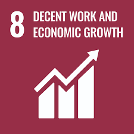

# Farmily - One-Stop Solution for Agriculture Landscape


## Overview

**Farmily** integrates a mobile app and IoT device to provide farmers with a unified platform, offering marketplace linkages and real-time analytics on weather and soil health. Employing a data-driven approach, it delivers personalized insights on plant and soil health monitoring, yield enhancement, and sustainable practices. The Android app serves as a comprehensive solution transforming the farming experience through streamlined features. 🌾🚀


## In-app Features

- **Secured Authentication:** Prioritizing privacy and security with OTP authentication. 🔒

- **Multilingual Support:** Choose your preferred language; presently, English is supported. 🌐

- **User Role Specification:** Tailoring functionalities for each user type (farmer, customer, seller) to ensure a personalized and seamless experience. 🌱

### Farming Assistance

- **AgroGuide:** Harness the power of ML for crop prediction, recommendations, and IOT crop monitoring. 🌱🤖
  
- **Weather Forecasts:** Receive hyperlocal weather forecasts and advisories. 🌦️⚠️
  
- **Buy & Rent:** Seamlessly access farming equipment and essentials. 🛒

### Support

- **In-app Chatbot:** Instant customer support and farming guidance bot. 🤖💬

## Important Links
- [APK]()
  

## Tech Stack

- Flutter
- Google AI Studio
- Google Teachable Machine
- Vertex AI
- Gemini API
- Weather API
- Firebase (Authentication, Firestore, Cloud Messaging)

## ✨ Requirements
* Any Operating System (ie. MacOS X, Linux, Windows)
* Any IDE with Flutter SDK installed (ie. IntelliJ, Android Studio, VSCode etc)
* A little knowledge of Dart and Flutter


## Steps to run the application

**_Clone the GitHub Repository:_**

  Open a terminal or command prompt and use the following command to clone the repository.

  ```python
  git clone https://github.com/BadassAman4014/Farmily-revised.git 
  ```


- Navigate to the Project Directory:

  Change your current directory to the cloned project's directory.

  ```python
  cd Farmily-revised
  ```

- Get Dependencies:

  Run the following command to get the dependencies needed for the Flutter project:
  ```python
  flutter pub get
  ```

- Get the suitable version of tflite to run the app :

  replace these lines in the tflite package build.gradle file
  example location C:\Users\"username"\AppData\Local\Pub\Cache\hosted\pub.dev\tflite-1.1.2\android\build.gradle
  ```python
  implementation 'org.tensorflow:tensorflow-lite:2.0.0' // Use a specific version
  implementation 'org.tensorflow:tensorflow-lite-gpu:2.0.0' // Use a specific version
  ```

After replacing it should look like 
``` python
  android {
    compileSdkVersion 28

    defaultConfig {
        minSdkVersion 19
        testInstrumentationRunner 'androidx.test.runner.AndroidJUnitRunner'
    }
    lintOptions {
        disable 'InvalidPackage'
    }

    dependencies {
        implementation 'org.tensorflow:tensorflow-lite:2.0.0' // Use a specific version
        implementation 'org.tensorflow:tensorflow-lite-gpu:2.0.0' // Use a specific version
    }
  }
```

- Run install.bat 

  While being in the same folder run the install.bat file using your command prompt.

  You may use this command :
  ```python
  install.bat
  ```

- Run the flutter application 

  ```python
  flutter run
  ```
  

## Usage

Explore the robust features of Farmily to streamline your agricultural activities and make informed decisions. The app provides timely weather insights, enabling farmers to prepare for climate extremes. Data-driven crop rotation suggestions and soil health monitoring enhance productivity. Equipment renting options and a direct marketplace streamline harvest sales, eliminating intermediaries. The app predicts and offers cures for plant diseases, provides a chatbot for farming guidance, and shares the latest farming news, ensuring farmers stay informed. Farmily empowers farmers with technology and knowledge, fostering sustainability, and improved livelihoods.🌾📊

## Future Outlook

## Crop Prediction Feature Enhancements
We're incorporating IOT for improved crop prediction in our pursuit of precision. Superior sensors will keep an eye on soil conditions, encouraging healthy development and increased yields.
💡🌱🚜
- Temperature
- Humidity
- Soil pH
- Rainfall

This data will be seamlessly sent to a real-time database, empowering our Google Colab ML model to predict crop yields and quality. 🌾📈

## Seller Dashboard

We're crafting a comprehensive dashboard for sellers/farmers to analyze and monitor:
- Sales
- Crop yield tracking
- Revenue

Empower yourself with data-driven insights to optimize production and skyrocket profits. 💹📊

## Agrohire: Labor Portal
We are working on developing a labor portal so that farmers can easily connect with available labor during crucial agricultural cycles, ensuring workforce availability for tasks like sowing, harvesting, and other key agricultural activities. 🧑‍🌾👩‍🌾

## UN Sustainable Development Goals and Targets:

<p align="center">
  
  
  
</p>

Goal 2 - Zero Hunger
        Target 2.3 - Double agricultural productivity and incomes of small-scale food producers.
        
Goal 8 - Decent Work and Economic Growth
         Target 8.2 - Achieve higher levels of economic productivity through diversification and technological upgrading.
         
Goal 12 - Responsible Consumption and Production
          Target 12.3 - Halve per capita global food waste and reduce food losses along production and supply chains.

## Our Members
- Valhari Meshram 
- Aman Raut
- Viranchi Dakhare
- Vishakha Fulare
            
### Contributors

Join us in cultivating innovation in Indian agriculture. Your contributions are the seeds of change! 🌱🤝


